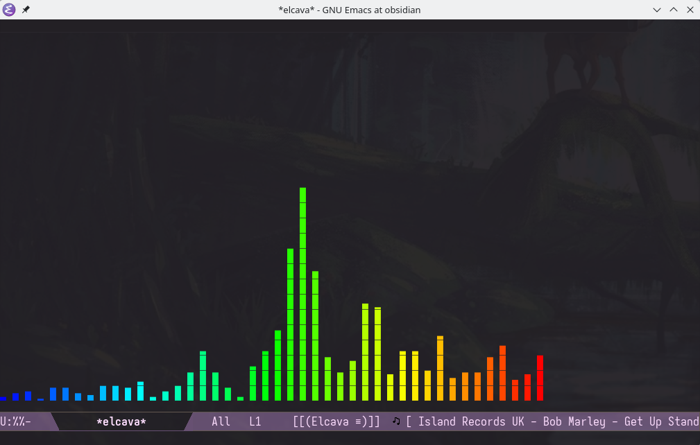

# elcava

Audio spectrum visualizer for Emacs. Captures system audio via PipeWire/PulseAudio, computes FFT in pure Elisp, and renders Unicode bar charts in a buffer. Linux/PipeWire only.



## Requirements

- Emacs 27.1+
- `parec` (from PipeWire or PulseAudio)

## Installation

### straight.el

```elisp
(use-package elcava
  :straight (:host github :repo "emacs-os/elcava")
  :commands elcava
  :custom
  (elcava-style 'spectrum))
```

### elpaca

```elisp
(use-package elcava
  :ensure (:host github :repo "emacs-os/elcava")
  :commands elcava
  :custom
  (elcava-style 'spectrum))
```

## Usage

`M-x elcava` — start the visualizer with music playing.

## Keybindings

| Key | Action |
|-----|--------|
| `m` | Cycle visualization style |
| `+` | More bars |
| `-` | Fewer bars |
| `q` | Quit |

## Styles

Set your default with `(setq elcava-style 'spectrum)`.

- `spectrum` — frequency bar chart
- `spectrum-reverse` — reversed frequency order
- `spectrum-notes` — bars with musical note labels
- `spectrum-freq` — bars with frequency labels
- `waveform` — oscilloscope-style rolling waveform

## Configuration

```elisp
(setq elcava-bars 24              ; number of bars
      elcava-framerate 60         ; target FPS
      elcava-noise-reduction 0.77 ; smoothing (0=fast, 1=smooth)
      elcava-gravity 1.8          ; bar falloff speed
      elcava-low-cutoff 50        ; low frequency Hz
      elcava-high-cutoff 10000    ; high frequency Hz
      elcava-parec-device "@DEFAULT_MONITOR@")
```
